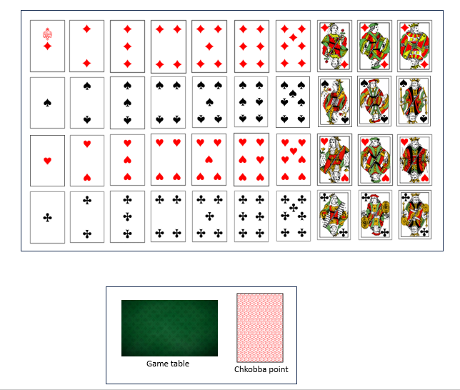

# Chkoba - Jeu de Cartes Traditionnel Tunisien

## Introduction

Ce projet consiste à développer une version numérique du jeu de cartes traditionnel tunisien **Chkoba**. Inspiré de la Scopa italienne, ce jeu oppose généralement deux joueurs ou deux équipes de deux. L'objectif est d'être le premier à atteindre un nombre de points prédéfini.

## Règles du jeu

### 1. Matériel

Le jeu utilise un jeu de 40 cartes, réparties en quatre enseignes : 
- **Pique (♠)**
- **Cœur (♥)**
- **Carreau (♦)**
- **Trèfle (♣)**

Les valeurs des cartes sont les suivantes :
- **Cartes numérotées :** de 1 à 7
- **Figures :** Dame (8), Valet (9), Roi (10)

### 2. Distribution des cartes

1. Un joueur mélange les cartes, et son adversaire coupe le paquet.
2. Le joueur tireur décide de **garder** ou de **poser** la première carte :
   - **Garder la carte :** Le tireur reçoit 2 cartes, le distributeur en prend 3, et 4 cartes sont posées sur la table.
   - **Poser la carte :** Chaque joueur reçoit 3 cartes, et 3 cartes sont posées sur la table.
3. Si trois cartes de même valeur sont posées sur la table, la distribution est refaite.
4. Chaque joueur commence avec 4 cartes sur la table et 3 cartes en main.

### 3. Déroulement du jeu

- **Tour de jeu :** Le joueur tireur joue en premier en posant une carte sur la table. Si un joueur ne peut pas « manger » une carte, il doit en poser une.
- **Manger des cartes :**
  - **Par valeur :** Un joueur peut prendre une carte de la même valeur que celle qu'il joue.
  - **Par addition :** Un joueur peut prendre plusieurs cartes dont la somme correspond à celle de la carte qu'il joue.
  - **Priorité :** La prise par valeur a priorité sur l'addition.
- Si un joueur joue toutes ses cartes, le distributeur lui en redonne 3, jusqu'à épuisement du paquet.
- **Fin de la manche :** Une manche se termine lorsque toutes les cartes ont été jouées. Si aucun joueur n'a atteint le score nécessaire pour gagner, une nouvelle manche commence.

### 4. Calcul des points

Les points sont marqués de deux manières :

1. **Points finaux :** Quatre points sont attribués en fonction des critères suivants :
   - **Kārṭa :** Point pour celui ayant le plus de cartes.
   - **Dīnārī :** Point pour celui ayant le plus de carreaux.
   - **Barmīla :** Point pour celui ayant le plus de 7.
   - **Saba ḥayya :** Point pour celui ayant le 7 de carreau.

2. **Chkobba :** Un point est marqué chaque fois qu'un joueur vide le plateau en prenant toutes les cartes.

## Ressources nécessaires

Pour réaliser ce jeu, nous aurons besoin des éléments suivants :

- **Tapis de jeu** : Un plateau sur lequel les cartes seront posées et le jeu se déroulera.
- **Cartes de jeu** : Les 40 cartes traditionnelles nécessaires pour jouer à la Chkoba, comprenant les quatre enseignes et leurs valeurs respectives.
