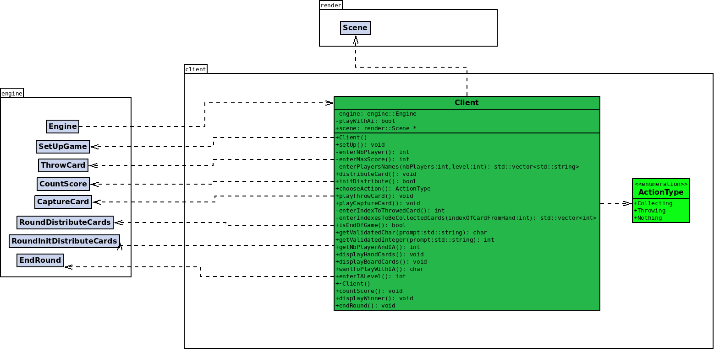

# Le Diagramme de Classe du Client

## 1. Stratégie
Le diagramme de classe du client illustre comment il communique avec le joueur pour gérer les interactions et récupérer les données nécessaires.  
Le but de la partie client est de fournir une interface interactive permettant aux joueurs de participer à une partie de Chkoba, soit contre une IA, soit contre d'autres joueurs humains.  
Le client doit gérer l'affichage des cartes, permettre les interactions des joueurs et intégrer les fonctionnalités du moteur de jeu pour appliquer les règles de Chkoba.

## 2. Conception Logicielle

### Diagramme :

### Configuration du Jeu
L'une des premières fonctionnalités implémentées est le choix de la configuration du jeu.  
Le client permet de sélectionner le nombre de joueurs (humains ou IA) ainsi que le niveau de difficulté de l’IA.  
En fonction des choix de l'utilisateur, le client ajuste l'interface et les comportements du jeu, pour s'assurer que l'expérience est fluide et cohérente.  
Le mode de jeu peut être configuré pour des parties contre une IA ou des parties multijoueurs entre humains. Cette flexibilité permet de s’adapter à différents types de joueurs.

### Affichage de l'État du Jeu
Une autre fonctionnalité essentielle est l'affichage de l’état du jeu.  
Chaque joueur peut voir ses cartes en main, et l’affichage dans la console met en évidence les actions possibles en fonction du tour du joueur et des règles en cours.  
La classe client gère aussi l'affichage du plateau de jeu, où les cartes sont distribuées et où se déroulent les différentes actions.  
Cet affichage dans la console permet de maintenir une expérience de jeu dynamique et intuitive, en permettant une navigation claire entre les différentes étapes du jeu.

### Interactions des Joueurs avec le Jeu
Le client gère également les interactions des joueurs avec le jeu.  
Lors de son tour, un joueur peut choisir les cartes à jouer ou à jeter. Pour ce faire, le client envoie les actions sélectionnées au moteur du jeu, qui valide ces décisions selon les règles.  
Si un joueur choisit de jouer contre une IA, l’intelligence artificielle prend des décisions en fonction du niveau de difficulté, et ces actions sont également traitées par le client et affichées en temps réel.

### Intégration de l'Intelligence Artificielle
L’intégration de l'IA dans le client représente une autre composante importante du projet.  
En fonction du niveau de difficulté sélectionné, l'IA peut effectuer des actions de manière plus ou moins stratégique, offrant un défi variable au joueur.  
Le client est responsable de la communication avec l'IA pour recevoir ses choix et afficher les résultats de manière transparente pour l'utilisateur.

### Communication avec le Moteur du Jeu
Enfin, la communication entre le client et l'engine du jeu est essentielle pour le bon fonctionnement de l'application.  
Le client échange régulièrement des informations avec l'engine pour mettre à jour l’état du jeu après chaque action des joueurs.  
Ce système de communication permet une synchronisation en temps réel, assurant que les joueurs aient une expérience fluide et que toutes les règles du jeu soient appliquées correctement.  
