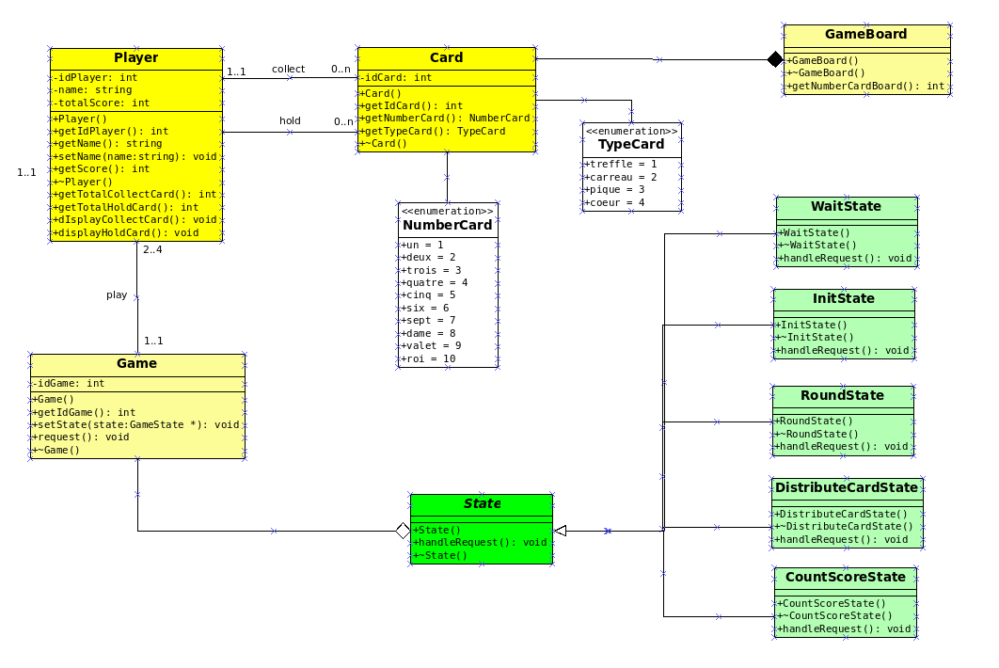

## 1. Description des États

Le jeu est structuré en plusieurs états distincts, chacun représentant une étape du déroulement de la partie. Voici une description détaillée des états qui permettent la progression du jeu :

### 1.1. États du Jeu

#### 1.1.1. **EnAttente**
- Cet état précède le début de la partie.
- Le jeu est en attente que les joueurs se connectent pour démarrer et initialiser la partie.

#### 1.1.2. **Initialisation**
- Le premier joueur initialise la partie en définissant certains paramètres :
  - Le nombre de joueurs : 2 joueurs ou 4 joueurs (2 vs 2).
  - Le nombre de points nécessaires pour terminer la partie : 11 ou 21.
- Le système mélange les cartes et coupe le paquet.
- Le joueur (tireur) reçoit une carte :
  - Il peut choisir de la garder, et dans ce cas, il reçoit deux cartes supplémentaires, les autres joueurs reçoivent également des cartes, puis 4 cartes sont posées sur le tapis.
  - Si le joueur pose la première carte sur le tapis, trois autres cartes sont ajoutées sur le tapis et chaque joueur reçoit 3 cartes supplémentaires.

#### 1.1.3. **EnPartie**
- Cet état représente le déroulement normal du jeu :
  - Le tireur joue la première carte sur la table.
  - Si un joueur ne peut pas "manger" une carte, il doit en poser une.
  - Un joueur peut manger des cartes soit par **valeur** (prendre une carte ayant la même valeur que l'une des siennes), soit par **addition** (prendre plusieurs cartes dont la somme correspond à l'une de ses cartes). **La prise par valeur est prioritaire sur la prise par addition.**

#### 1.1.4. **DistributionCartes**
- Lorsque tous les joueurs n'ont plus de cartes en main, le système distribue trois cartes supplémentaires à chaque joueur, permettant ainsi de poursuivre la partie.

#### 1.1.5. **CalculScore**
- Lorsque toutes les cartes ont été jouées, les points sont comptabilisés selon les règles du jeu.
  - Si le jeu se déroule avec 4 joueurs (2 vs 2), les scores de chaque équipe sont additionnés.
  - Si le score total d'un joueur ou d'une équipe est inférieur à 11 ou 21 (selon ce qui a été décidé au début), une autre manche est jouée.
  - Si un joueur ou une équipe atteint ou dépasse 11 ou 21 points, il est déclaré vainqueur et la partie se termine.

## 2. Conception Logicielle

### 2.1. Diagramme de Classe

Le diagramme des classes pour la gestion des états du jeu est structuré autour de plusieurs classes importantes :

#### 2.1.1. **Classe Joueur**
- Attributs :
  - Identifiant unique du joueur.
  - Nom du joueur.
  - Score total.
- Comportement :
  - Chaque joueur possède 3 cartes à chaque tour et tente de "manger" des cartes sur le tapis en fonction des règles du jeu.

#### 2.1.2. **Classe Carte**
- Attributs :
  - Numéro de la carte (de 1 à 10).
  - Type de carte (Trèfle, Pique, Cœur, ou Carreau), modélisé par une énumération.

#### 2.1.3. **Classe TapisJeu**
- Attributs :
  - Le tapis peut contenir zéro ou plusieurs cartes à tout moment, en fonction de l'état de la partie.
- Comportement :
  - Cette classe permet de suivre l'état du tapis et de vérifier si une **chkobba** a été réalisée (qui vaut +1 point), en analysant l'état du tapis après chaque tour de jeu.

