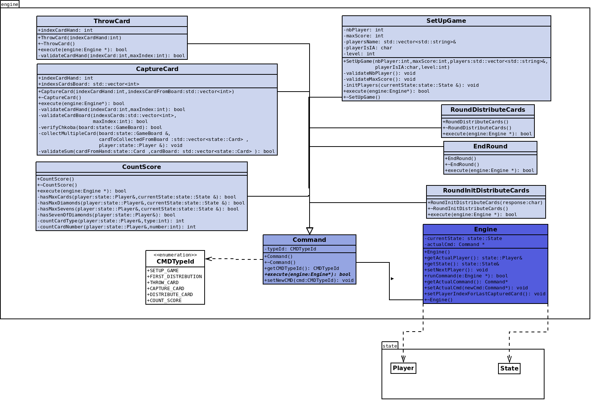

# Règles de changement d’état et moteur de jeu

## 1. Changements extérieurs

### Initialisation
Lors de l'initialisation de la partie, le premier joueur définit les paramètres externes, tels que :
- **Nombre de joueurs** : 2 ou 4.
- **Nombre de points nécessaires pour gagner** : 11 ou 21.

Ensuite, le système mélange et coupe les cartes, modifiant ainsi l'état initial du jeu indépendamment des actions des joueurs. Ce processus affecte :
- La configuration de départ de la partie.
- La distribution des cartes.
- L'état initial du paquet.

### En Partie
- Lorsqu'un joueur (tireur) joue la première carte sur le tapis, cela influence les choix des autres joueurs.
- Si un joueur ne peut pas capturer une carte, il doit en poser une, ce qui modifie l'état global du jeu.
- Les actions des joueurs (capturer ou poser une carte) modifient l'évolution des cartes sur le plateau.

---

## 2. Changements autonomes

### Initialisation
Le tireur prend une décision autonome :
- **Garder ou poser la première carte**.
    - Si la carte est gardée, le tireur reçoit deux cartes supplémentaires.
    - Sinon, les autres joueurs en bénéficient.

Cette action influence directement l'état initial du plateau.

### Distribution des cartes
Lorsque les joueurs n'ont plus de cartes en main :
- **Le système distribue automatiquement 3 cartes supplémentaires à chaque joueur.**  
  Cela permet de poursuivre la partie en modifiant l'état des mains des joueurs.

### Calcul du score
À la fin de la partie :
- **Le système comptabilise les points** selon les règles définies.
- Si un joueur ou une équipe atteint le score fixé (11 ou 21), la partie se termine et un vainqueur est déclaré.

---

## 3. Conception logicielle 

Le moteur du jeu repose sur plusieurs classes clés, chacune ayant un rôle spécifique dans la gestion des actions et de l'état du jeu.

### Diagramme :

 

### Classes principales

#### **Classe `Engine`**
- Gère le moteur du jeu, centralisant l'exécution des commandes et l'état global.
- Interagit avec les joueurs pour gérer les actions, comme le passage au joueur suivant ou l'exécution d'une commande spécifique.
- Maintient l'état du jeu via :
    - `currentState` : état actuel du jeu.
    - `actualCmd` : commande en cours d'exécution.

#### **Classe `Command`**
- Représente une commande générique.
- Détermine les actions que le jeu peut exécuter via :
    - `CMDTypeId` : identifiant du type de commande.
    - Méthodes pour récupérer ou modifier cet identifiant.

---

### Commandes principales du jeu

#### **`SetUpGame`**
- Initialise la partie en validant :
    - Nombre de joueurs.
    - Score maximum.
    - Ajout des joueurs (humains ou IA).
- Configure les paramètres de la partie et gère l'ajout d'IA selon différents niveaux de difficulté.

#### **`RoundInitDistributeCards`**
- Gère la distribution des cartes au début de chaque manche :
    - Si le joueur accepte (réponse "y" ou "Y"), 3 cartes sont distribuées à chaque joueur, puis 4 cartes sur le plateau.
    - Sinon, 4 cartes sont distribuées sur le plateau, puis 3 cartes à chaque joueur.

#### **`RoundDistributeCards`**
- Distribue 3 cartes à chaque joueur pendant la partie, en appelant la méthode `distributeCards` sur l'objet `CardsDeck`.

#### **`ThrowCard`**
- Permet à un joueur de poser une carte sur le plateau.
- Valide l'index de la carte avant de la retirer de la main du joueur et de l’ajouter au plateau.
- Passe au joueur suivant une fois l'action terminée.

#### **`CaptureCard`**
- Permet à un joueur de capturer une carte selon les règles du jeu :
    - Valide les indices de la carte à capturer et celles du plateau.
    - Vérifie la correspondance directe ou les sommes pour capturer.
- Ajoute la carte capturée aux cartes collectées du joueur.
- Si le plateau est vide, une "chkoba" est déclarée, et le joueur gagne un point.

#### **`CountScore`**
- Calcule et attribue les points en fin de partie selon :
    - Nombre de cartes collectées.
    - Cartes spécifiques (diamants, "Sept").
    - Possession du "Sept de Diamants".

#### **`EndRound`**
- Termine la manche en vérifiant :
    - Si le deck est vide.
    - Si les joueurs ont joué toutes leurs cartes.
    - Si le plateau n’est pas vide.
- Les cartes restantes sont attribuées au dernier joueur ayant capturé.

