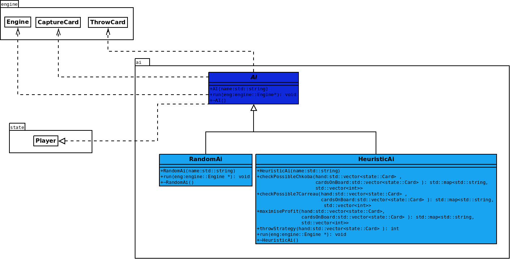
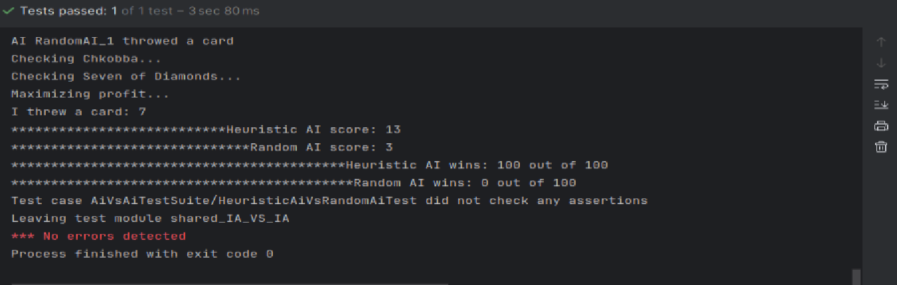
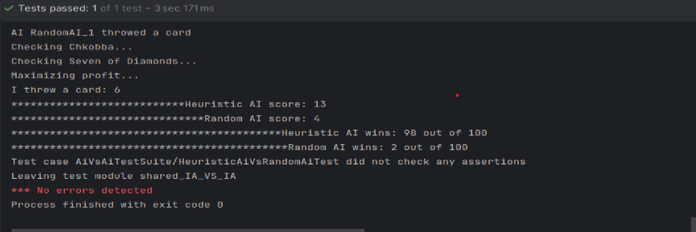

# Intelligence Artificielle

## 1. Stratégies :
- **Intelligence minimale**  
  Dans un premier temps, IA choisit aléatoirement une action à effectuer durant son tour.  
  Elle tente d'abord de capturer une carte du plateau si elle trouve une correspondance avec une carte de sa main, sinon elle jette une carte au hasard du jeu.

- **Intelligence basée sur des heuristique**  
  Cette intelligence implémente une IA plus complexe que la précédente, utilisant une série de stratégies basées sur des heuristiques pour décider de ses actions.  
  Avant de jeter une carte, l'IA vérifie d'abord s'il existe une possibilité de capture en utilisant trois stratégies distinctes.

    - Elle commence par chercher une condition de **Chkobba**, où une carte de la main peut capturer toutes les cartes sur le plateau si sa valeur correspond à la somme totale des cartes du plateau.

    - Ensuite, elle vérifie la présence d'un **Sept de Carreau**, cherchant à capturer un "Sept de Carreau" de sa main si l'une de ces cartes se trouve également sur le plateau, ou en trouvant une combinaison de cartes dont la somme équivaut à 7.

    - Enfin, l'IA applique une logique de **maximisation du profit**, en recherchant les cartes de la main qui peuvent être capturées de manière stratégique en fonction de leur valeur, en priorisant les cartes de type carreau ou les cartes "Sept".

  Si aucune de ces stratégies ne permet une capture, l'IA sélectionne alors une carte à jeter en choisissant celle ayant la plus faible valeur.

### Diagramme :

---

## 2. IA Random contre IA Heuristique

Nous avons réalisé un test où l'IA Random affrontait l'IA Heuristique sur 100 rounds.  
Il a été observé que l'IA Heuristique remportait largement plus de victoires que l'IA Random, ce qui est logique en raison des règles stratégiques implémentées dans l'IA Heuristique.

