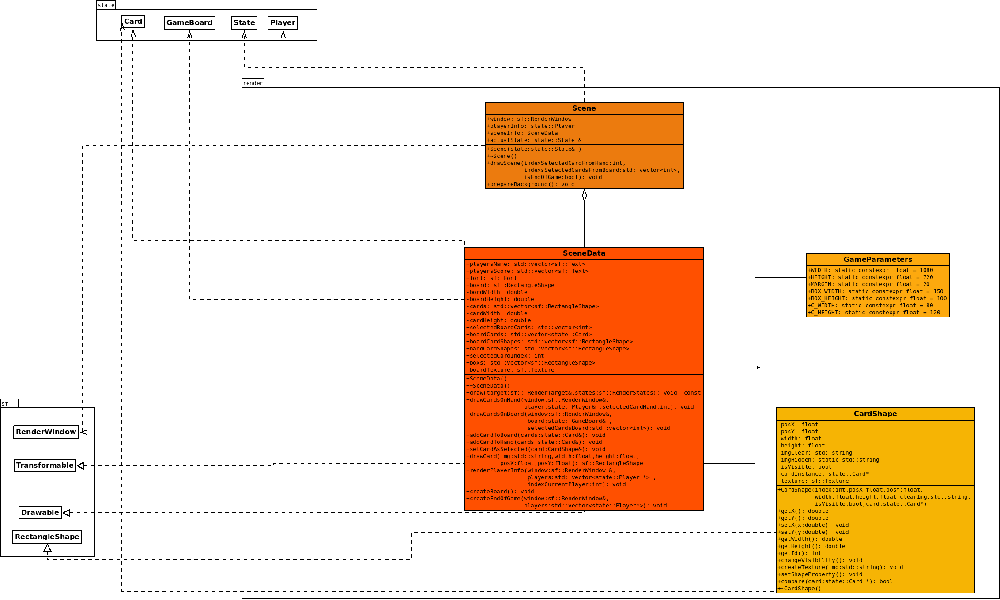

# Rendu : Stratégie et conception

## 1. Stratégie de rendu d’un état
Le rendu est divisé en trois parties :
- **Scene** : affiche la fenêtre où tout le jeu est rendu.
- **SceneData** : gère les composants de la fenêtre tels que la largeur, la hauteur, les paramètres associés, les polices de texte, etc.
- **CardShape** : est utilisée pour afficher et gérer les cartes du jeu.

## 2. Conception logicielle
Ce diagramme illustre l'affichage graphique du jeu. Nous allons maintenant examiner en détail les différentes classes qui le composent.  

### Diagramme :

### Classe Scene
La classe Scene gère l'affichage graphique du jeu, en créant et affichant une fenêtre de jeu avec un arrière-plan et en dessinant les éléments du jeu comme le tableau, les cartes des joueurs et les informations sur l'état du jeu. La méthode `drawScene` dans cette classe prépare et affiche les différentes parties de la scène, y compris les cartes en main des joueurs, les cartes sur le plateau et un message de fin de jeu si nécessaire.

### Classe SceneData
La classe SceneData permet de gérer l'interface graphique d'un jeu de cartes en utilisant la bibliothèque SFML.
- Elle commence par initialiser une fenêtre et charger les ressources nécessaires, telles que les images des cartes.
- Ensuite, elle calcule et positionne les cartes sur le plateau de jeu et dans les mains des joueurs, en veillant à ce que chaque carte soit correctement affichée.
- Elle met également à jour et affiche les scores des joueurs en temps réel.
- Enfin, une fois la partie terminée, elle doit afficher un message de victoire et les scores finaux.

### Classe CardShape
La classe CardShape gère l'affichage graphique d'une carte, avec des propriétés telles que la position, la taille, et la visibilité, tout en utilisant une texture pour représenter l'image de la carte.
- Elle permet de créer et de manipuler cette carte, en chargeant une texture, en modifiant sa visibilité, et en comparant les cartes via une instance de la classe `state::Card`.

**Voici un aperçu de notre interface graphique.**
