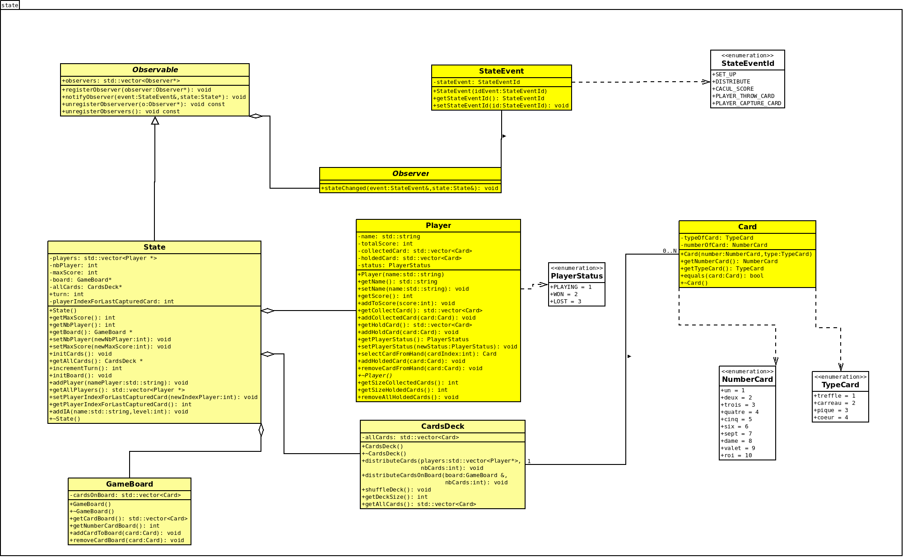

# Diagramme de classe d’état

## 1. Description d’état

Le diagramme de classes de l'état permet d'identifier les composants essentiels du jeu, où chaque classe représente un élément fondamental du jeu. Il met en évidence les états clés du jeu et les relations entre ces différents composants.

Le **State** gère l'état global du jeu et supervise son déroulement, le **Player** représente les joueurs en suivant leurs cartes et scores, le **GameBoard** s'occupe des cartes placées sur le plateau, et le **CardsDeck** est responsable de la création, du mélange et de la distribution des cartes. Ensemble, ces composants assurent le bon fonctionnement et la logique du jeu.

## 2. Conception logicielle 

Ce diagramme représente le diagramme de classes de l'état du jeu, et nous allons détailler les différentes classes qui le composent.

### Diagramme :

### Classes :
- **Classe State**  
  La classe State représente l'état global du jeu, en gérant les joueurs, le plateau de jeu, le paquet de cartes, et les paramètres liés au déroulement de la partie (tour, score maximal, etc.).  
  Elle offre des méthodes pour :
    - Initialiser les composants du jeu.
    - Ajouter des joueurs ou des IA.
    - Suivre les informations essentielles, comme l'indice du dernier joueur ayant capturé une carte.

- **Classe Player**  
  La classe Player représente un joueur du jeu et gère :
    - Ses informations personnelles.
    - Son statut.
    - Ses cartes en main (*holdedCard*).
    - Ses cartes collectées (*collectedCard*).
    - Son score total.  
      Elle fournit des méthodes pour :
    - Ajouter ou retirer des cartes.
    - Sélectionner une carte de la main.
    - Mettre à jour son score ou son statut.

- **Classe GameBoard**  
  La classe GameBoard représente le plateau de jeu, où les cartes en jeu sont placées et manipulées.  
  Elle propose des méthodes pour :
    - Ajouter des cartes au plateau.
    - Retirer des cartes spécifiques.
    - Obtenir la liste actuelle des cartes présentes sur le plateau.
    - Connaître leur nombre total.

- **Classe CardsDeck**  
  La classe CardsDeck représente le paquet de cartes utilisé dans le jeu. Elle gère :
    - La création d'un jeu complet de cartes (par type et par valeur).
    - La distribution des cartes aux joueurs ou au plateau de jeu.
    - Le mélange des cartes de manière aléatoire.  
      Elle fournit aussi des méthodes pour :
    - Consulter la taille ou le contenu du paquet.

- **Classe Card**  
  La classe Card représente une carte du jeu, définie par :
    - Son numéro (*numberOfCard*).
    - Son type (*typeOfCard*).  
      Elle propose des méthodes pour :
    - Obtenir ces propriétés.
    - Comparer deux cartes avec la méthode *equals*, qui vérifie si deux cartes ont le même numéro et le même type.
